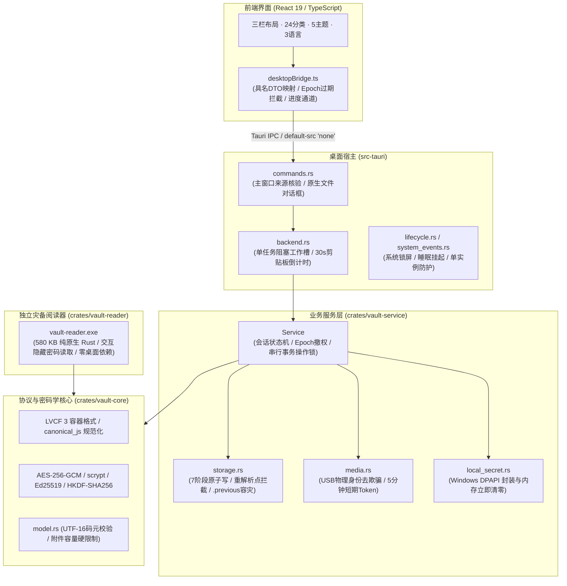

<div align="center">

# LegacyLock V2

### The Security Harness & Digital Inheritance Vault for Windows Desktop

**LVCF 3 Protocol · AES-256-GCM · Dual-Credential · 2-of-2 Air-Gapped USB Recovery · 7-Stage Atomic Transaction · Windows DPAPI · Zero-Cloud Telemetry**

High-performance, offline-first digital asset vault and crash-resilient inheritance harness built with Tauri 2 + Rust and React 19.

[简体中文](README.md) | [English](README.en.md)

[📖 开发维护指南](docs/开发维护指南.md) | [📑 接口与配置索引](docs/接口与配置索引.md) | [🛡️ 全面安全审计报告](docs/安全审计报告.md) | [📦 测试包说明](docs/测试包说明.md) | [🔄 使用与迁移说明](docs/使用与迁移说明.md) | [📐 原始规范与验收](docs/tauri2-rust/开发设计与迁移规范.md)

---

[](https://github.com/vicky-clair/xr-legacylock-v2)
[](rust-toolchain.toml)
[](src-tauri/Cargo.toml)
[](package.json)
[](crates/vault-core)
[](docs/安全审计报告.md)

</div>

## 💡 项目简介

**LegacyLock V2** 是面向 Windows 桌面环境的独立离线保险库系统与数字遗产继承框架。项目依据 `tauri2-rust/` 开发规范与验收要求，完成了从早期 Electron 架构到 **Tauri 2 + 模块化 Rust 核心** 的跨代重构。

系统通过纯密码学保证数据主权：**零云端通信、零遥测收集、物理断网可用**。采用自主设计的 **LVCF 3 (LegacyLock Vault Container Format v3)** 容器，支持双凭据认证、2-of-2 空气隔离双 U 盘继承人只读恢复、Windows DPAPI 本机安全记忆与七阶段崩溃一致性事务。

---

## ✨ 核心特性亮点

| 特性维度 | 功能设计 | 安全与实现机制 |
|---|---|---|
| **双凭据认证** | 主密码 + 256 位安全密钥 (LL3) | 经 `scrypt` ($N=32768, r=8, p=1$) 联合派生，输入封装为 JSON 数组杜绝边界拼接碰撞 |
| **密码学加固** | AES-256-GCM + Ed25519 签名 | 96 位独立随机 Nonce；AAD 强绑定密库 ID、签名公钥及槽位类型，阻断跨密库与跨槽替换 |
| **崩溃一致事务** | 七阶段原子替换与回滚 | 随机临时文件 $\to$ `sync_all` 硬件下盘 $\to$ 读回验签 $\to$ CAS 检查 $\to$ `.previous` 备份 $\to$ `MoveFileExW` 写穿替换 |
| **双 U 盘继承恢复** | 2-of-2 物理隔离恢复机制 | 物理去欺骗（通过 WMI 校验 `UniqueId`，拒绝同盘双分区）；副盘仅存份额；拔盘 5 秒心跳自动锁定 |
| **权限与能力隔离** | 签名私钥仅所有者持有 | 继承会话仅解密 VMK，不持有 Ed25519 私钥，密码学根源上剥离写入能力；IPC 严格绑定主窗口来源 |
| **DPAPI 本机记忆** | Windows 原生安全存储 | 当前用户级 DPAPI 保护安全密钥，解密后原生缓冲区主动覆写清零（`Zeroize`）；换凭据自动作废 |
| **防数据泄露 IPC** | 数据最小化与剪贴板防护 | 搜索在 Rust 内存执行仅回传 ID；详情按需加载；复制口令 30 秒自动清理并在密库锁定时即刻销毁 |
| **极轻独立阅读器** | `vault-reader.exe` (580 KB) | 零 UI / 零 WebView / 零 Node 依赖的独立 Rust 灾备命令行工具，应急解密导出明文 |

---

## 🏛️ 系统架构设计



---

## 📦 分发包规格与体积说明

本项目提供多种规格的 Windows x64 分发版本，满足日常使用与极端离线灾备场景：

| 分发包类型 | 产物文件名 | 文件大小 | 适用场景与运行依赖 |
|---|---|---:|---|
| **精简版安装包** *(推荐)* | `LegacyLock-V2-0.2.0-preview-setup-win-x64.exe` | **2.81 MB** | **个人电脑首选**。复用系统已安装的 Edge WebView2，安装迅速轻便 |
| **便携免安装包** | `LegacyLock-V2-0.2.0-portable-win-x64.zip` | **4.46 MB** | **随身 U 盘即插即用**。解压即运行，包含应用本体、独立阅读器与文档 |
| **独立灾备阅读器** | `vault-reader.exe` | **0.55 MB (581 KB)** | **极端灾难急救恢复**。纯原生 Rust CLI，零 UI 依赖，任何 Windows 电脑均可解密 |
| **完整离线安装包** | `LegacyLock-V2-0.2.0-offline-setup-win-x64.exe` | **207.83 MB** | **断网冷机 / 专用机房**。**内嵌 202 MB 微软官方离线 WebView2 运行库安装器** |

> [!NOTE]
> **关于离线安装包体积的说明**：
> 完整离线安装包之所以达到约 208 MB，是因为打包了完整的微软官方 `Microsoft Edge WebView2 Evergreen Standalone Installer (x64)` 离线运行库（大小为 **202.38 MB**），以便在完全无法联网且缺少运行库的老旧或精简版 Windows 设备上完成初始化安装。应用程序自身的代码和静态资产实际仅占 **约 5.4 MB**。

---

## 🚀 快速开始与自动化验证

### 1. 开发环境要求
- **操作系统**：Windows 10 / 11 x64
- **Rust 工具链**：1.91.1 (`rust-toolchain.toml` 锁定，包含 `rustfmt` 与 `clippy`)
- **Node.js**：v24.x LTS / npm
- **C++ 工具链**：Visual Studio 2022 MSVC C++ 构建工具与 Windows SDK

### 2. 本地开发与启动
```powershell
# 安装前端依赖
npm ci

# 启动开发预览 (Tauri 桌面应用)
npm run tauri dev
```

### 3. 全套回归验证
项目内置了工业级的一键端到端验证脚本：
```powershell
# 运行全套检查：代码规范、静态检查、单元测试、崩溃故障注入、Node/Rust跨语言互通
./scripts/verify.ps1

# 单独运行后端性能微基准采样
cargo run -p vault-service --example benchmark --release --locked
```

### 4. 生产包构建
```powershell
# 构建独立离线阅读器
cargo build -p vault-reader --release --locked

# 构建精简版安装包并收集产物
npm run package:preview
./scripts/collect-release.ps1

# 构建完整离线安装包并收集产物
npm run package:offline
./scripts/collect-release.ps1 -Offline
```

---

## 📟 独立恢复阅读器使用说明

当桌面环境损坏或需要在未安装 WebView2 的断网电脑上紧急导出资产时，可直接使用独立阅读器：

```powershell
# 1. 所有者模式 (交互式安全输入密码与 LL3 安全密钥)
.\vault-reader.exe owner backup.llvault recovered_plaintext.json

# 2. 继承人恢复模式 (传入主副 U 盘中提取的恢复密钥)
.\vault-reader.exe recovery backup.llvault primary.llkey secondary.llkey recovered_plaintext.json
```
> [!WARNING]
> 导出的 JSON 包含解密后的完整资产明文与附件，请妥善保存在安全的介质上，避免明文泄露。

---

## 📋 阶段验收与发布门槛状态

依据 [`docs/阶段验收记录.md`](docs/阶段验收记录.md) 与 [`docs/安全审计报告.md`](docs/安全审计报告.md)，当前交付状态如下：

- [x] **P0 冻结与工程隔离**：独立 Tauri 2 工程、依赖锁定、61 个基准规范文件哈希全部匹配。
- [x] **P1 协议核心与阅读器**：纯 Rust LVCF 3 库、Node/Rust 双向互操作、580 KB 灾难恢复命令行。
- [x] **P2 UI 与 IPC 边界**：原三栏布局保留、具名 DTO、锁定 Epoch 拦截、严格本地 CSP。
- [x] **P3 数据一致性与事务**：七阶段故障注入验证、CAS 乐观锁、`.previous` 回退、Windows DPAPI 内存清零。
- [x] **P4 硬件介质与桌面生命周期**：物理 U 盘去欺骗校验、拔盘心跳锁定、系统锁屏/睡眠通知挂钩、30秒剪贴板清理。
- [ ] **商用发布门槛 (待执行)**：
  - 配置企业 EV 代码签名证书（当前测试版为 `NotSigned`）。
  - 连接两块不同品牌的实际物理 U 盘，完成真实拔插、满盘与断电实机破坏性测试。
  - 在实际物理机上进行端到端冷热启动真实时延与内存占用采样。

---

## 📄 许可证与文档索引

- [开发维护指南](docs/开发维护指南.md)
- [接口与配置索引](docs/接口与配置索引.md)
- [全面安全审计报告](docs/安全审计报告.md)
- [测试包与发布说明](docs/测试包说明.md)
- [使用与迁移说明](docs/使用与迁移说明.md)
- [协议兼容策略](docs/协议兼容策略.md)
- [阶段验收记录](docs/阶段验收记录.md)
