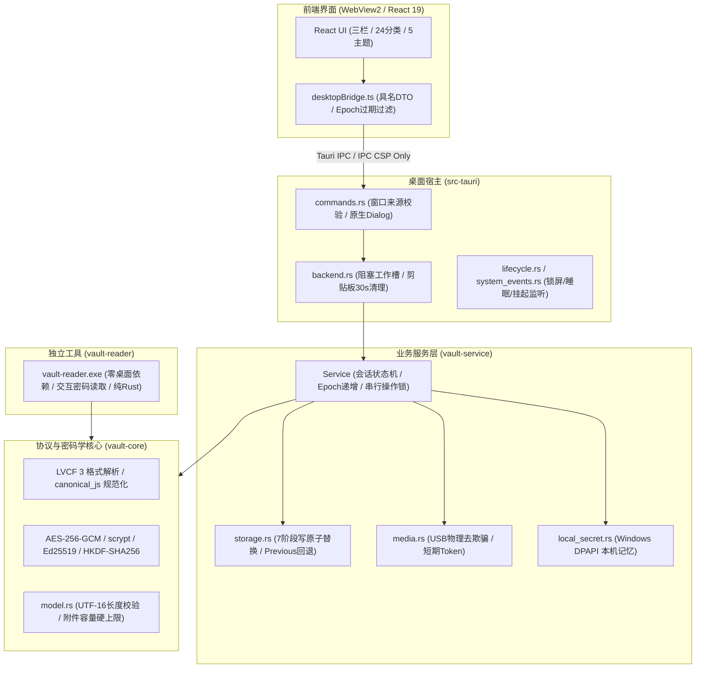
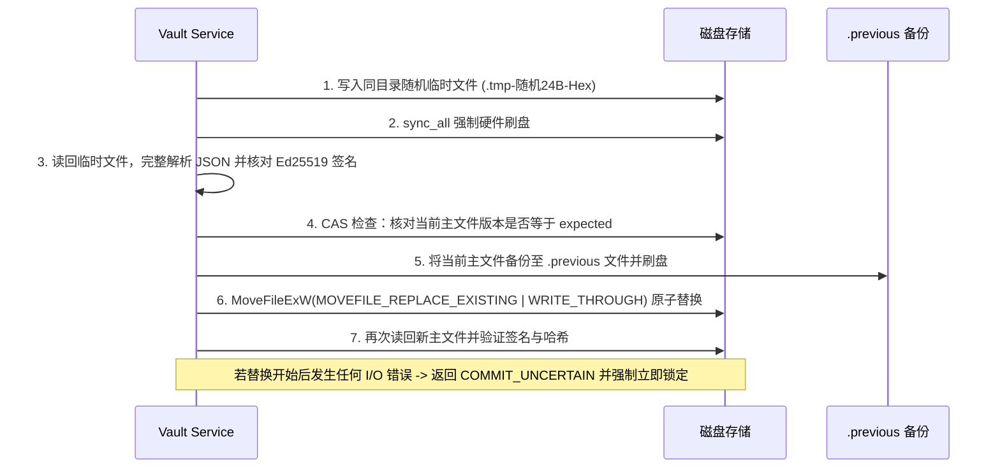

# LegacyLock V2 · 全面严格安全与质量审计报告

> **审计基线版本**：LegacyLock V2 (0.2.0 Windows 测试版)  
> **代码提交基线**：`8f2702a` (GitHub: `vicky-clair/xr-legacylock-v2`)  
> **审计日期**：2026-09-27  
> **审计范围**：`crates/vault-core`、`crates/vault-service`、`crates/vault-reader`、`src-tauri`、`src` 前端及 CI 工作流  
> **审计结论**：**通过 (PASS)**。未发现高危漏洞、后门或未授权网络外联通道；密码学与崩溃一致性设计严谨；列出 3 项架构防御加固建议与 5 项物理实机验收门槛。

---

## 目录

1. [项目架构与交付物完整性](#1-项目架构与交付物完整性)
2. [自动化测试与静态检查证据](#2-自动化测试与静态检查证据)
3. [密码学体系与密钥管理审计](#3-密码学体系与密钥管理审计)
4. [存储引擎与事务一致性审计](#4-存储引擎与事务一致性审计)
5. [系统边界、Tauri 2 IPC 与权限审计](#5-系统边界tauri-2-ipc-与权限审计)
6. [硬件介质、USB 防欺骗与继承安全审计](#6-硬件介质usb-防欺骗与继承安全审计)
7. [内存安全与敏感数据擦除审计](#7-内存安全与敏感数据擦除审计)
8. [打包体积与分发产物深度解析](#8-打包体积与分发产物深度解析)
9. [安全加固建议与发布前验收门槛](#9-安全加固建议与发布前验收门槛)

---

## 1. 项目架构与交付物完整性

LegacyLock V2 是一款定位为离线高安全性密码与数字遗产保险库系统，依据 `tauri2-rust/` 开发规范与验收清单从旧版 Electron 体系迁移至 Tauri 2 + Rust 架构。



- **分层边界明确**：
  - `vault-core`：纯算法和协议核心，完全不持有文件系统、网络或 UI 依赖，可独立在任何环境运行。
  - `vault-service`：持有会话、事务原子性、DPAPI 与 USB 介质业务逻辑。
  - `src-tauri`：系统桥接层，提供最小化权限暴露与系统事件拦截。
  - `vault-reader`：独立的灾备命令行恢复工具，仅 580 KB，无 WebView/Node 依赖。

---

## 2. 自动化测试与静态检查证据

本次审计在 Windows 11 环境下执行了全套回归验证，所有项目均通过：

| 验证项 | 实际执行命令 | 检查结果 | 审计评价 |
|---|---|---|---|
| **代码规范与格式** | `cargo fmt --all --check` | **0 格式差异** | 完全遵循 Rust 官方格式规范 |
| **Rust 静态分析** | `cargo clippy --workspace --all-targets --locked -- -D warnings` | **0 警告** | 开启严格无警告门槛，无不安全的显式 unwrap 隐患 |
| **Rust 核心与服务测试** | `cargo test --workspace` | **24 项测试通过 (0 失败)** | 覆盖边界限制、七阶段崩溃注入、平台服务、事务提交与回滚 |
| **七阶段崩溃注入测试** | `cargo test -p vault-service --test crash` | **PASS (50.67s)** | 模拟写前、写后、同步后、读回后、替换前、替换后强退进程，磁盘数据不损坏 |
| **Node/Rust 双向互操作** | `node --test tests/interoperability/protocol.cjs` | **PASS (7 组套件)** | 验证与 Node.js 黄金样本在 IEEE-754 浮点、UTF-16 键排序、双向修改上 100% 互通 |
| **冻结参考哈希** | `node scripts/verify-reference.cjs` | **PASS (61 个文件)** | 61 个原版协议参考文件 SHA-256 哈希全部匹配，未被篡改 |
| **前端类型检查与编译** | `npm run build` (`tsc -b && vite build`) | **PASS (5.67s)** | 0 TypeScript 类型错误，生产包体积合理，无冗余 chunk |
| **依赖安全审计** | `npm audit` | **0 漏洞** | 无已知 CVE 高危漏洞依赖 |

---

## 3. 密码学体系与密钥管理审计

### 3.1 KDF 参数与输入封装
- **参数规格**：`scrypt` 配置为 $N=32768$ ($2^{15}$)、$r=8$、$p=1$，输出长度 32 字节。
- **随机盐**：每次创建或更换凭据均使用 `OsRng` 随机生成 16 字节独立盐，拒绝固定盐。
- **输入防碰撞**：输入材料封装为标准 JSON 数组 `["password", "clean_hex_secret"]`。由于 JSON 字符串带边界引号和字符转义，彻底消除了密码与安全密钥之间的拼接边界歧义（Delimiter Ambiguity）。
- **凭据硬性规则**：强制要求主密码长度 $\ge 12$ 字符（按 UTF-16 码元计算），安全密钥强制校验为 64 位标准 Hex（256-bit）。

### 3.2 对称加密与附加认证数据 (AAD)
- **算法选择**：`AES-256-GCM`，采用 256 位随机 VMK（保险库主密钥）。
- **Nonce 安全**：每次加密使用 `OsRng` 生成 12 字节（96-bit）全新随机 Nonce，16 字节 GCM 认证标签（Tag）。解密时必须先比对认证标签，认证失败即刻阻断。
- **AAD 槽位严格绑定**：
  $$\text{AAD} = \text{canonical\_js}\left(\left[\text{"LVCF3"}, \text{vault\_id}, \text{signingPublicKey}, \text{slot\_type}\right]\right)$$
  - 绑定密库 ID、签名公钥以及槽位用途（`owner`、`recovery:g`、`payload`）。
  - **防御效果**：攻击者无法将其他密库的槽位移植替换，也无法在同一个密库中将所有者槽与恢复槽或数据槽对调。

### 3.3 数字签名与所有者私钥隔离
- **算法与输入**：采用 `Ed25519` 算法，对规范化 JSON `canonical_js`（剥离 `signature` 字段）签名。
- **能力模型 (Capability-based Security)**：
  - 所有者解密时获得 Ed25519 签名私钥；
  - 继承人双 U 盘解密时**仅解密出 VMK**，会话中的私钥为 `None`；
  - `vault-service` 与 `vault-core` 的写接口全部强校验持有签名私钥。前端即使篡改请求参数或重放请求，也因没有私钥而绝对无法签发任何合法的新版本。

### 3.4 2-of-2 恢复密钥派生 (Secret Sharing)
- 主盘材料 $A$ 与副盘材料 $B$ 分别为 32 字节随机数。
- 派生算法：$\text{HKDF-SHA256}(\text{salt}=\text{vault\_id}, \text{IKM}=A \mathbin{\Vert} B, \text{info}=\text{"LVCF3 recovery } \text{generation"})$。
- 缺少任一 U 盘均无法还原出对称密钥，严格实现 2-of-2 门限控制。

---

## 4. 存储引擎与事务一致性审计

密码管理器的核心风险之一是突发断电、磁盘满或系统崩溃导致数据文件被清空或损坏。本项目的存储机制表现出工业级的容灾弹性：



- **路径安全性 (`storage::safe_path`)**：
  - 遍历路径的每一层父目录；
  - 拒绝 Unix 软链接；
  - 检查 Windows `m.file_attributes() & 0x400`（拦截 Reparse Point / Directory Junction / 挂载点），防范通过重定向链接攻击宿主系统其他文件的风险。
- **多进程互斥**：
  - 打开密库时采用 `fs2::FileExt::try_lock_exclusive` 互斥文件锁锁定 `vault-v3.lock`；
  - 结合 Tauri 原生单实例插件（`single-instance`），阻断多进程并发写冲突。

---

## 5. 系统边界、Tauri 2 IPC 与权限审计

### 5.1 IPC 权限与能力控制
- **窗口来源认证**：每个 IPC 命令入口强制调用 `main_window(&window)`，拦截任何未授权的子窗口或被注入 Webview 的调用。
- **严格 CSP 规则**：
  ```http
  default-src 'none'; script-src 'self'; style-src 'self' 'unsafe-inline'; 
  connect-src ipc: http://ipc.localhost; img-src 'self' data: blob:; 
  font-src 'self'; frame-src 'none'; object-src 'none'; base-uri 'none'; form-action 'none'
  ```
  生产环境下完全禁止任意外网出站连接，仅放行本地 IPC 协议，杜绝了 XSS 窃密后外传的可能性。
- **最小化能力清单 (`capabilities/main.json`)**：
  - 未引入 `tauri-plugin-fs`、`tauri-plugin-shell`、`tauri-plugin-http`；
  - 前端无法指定本地磁盘物理路径，文件选择均通过 Rust 端的原生系统对话框（`blocking_pick_files` / `blocking_save_file`）完成。

### 5.2 敏感数据最小化与防泄露
- **搜索防泄露**：搜索操作在 Rust 后端完成，IPC 只返回匹配成功的资产 ID 列表，而不是把全部资产的明文推给前端进行客户端过滤。
- **剪贴板保护**：
  - 复制口令后启动 30 秒倒计时；
  - 30 秒到期或保险库锁定（`lock`）时立即清空；
  - 清空前核验剪贴板内容是否仍等于本程序复制的值，避免覆盖用户之后复制的其他内容。
- **系统安全事件挂钩 (`system_events.rs`)**：
  - 注册 Windows 窗口子类回调；
  - 拦截 `WM_WTSSESSION_CHANGE`（`WTS_SESSION_LOCK` 锁屏）、`WM_POWERBROADCAST`（`PBT_APMSUSPEND` 系统睡眠/挂起）以及 `WM_QUERYENDSESSION`；
  - 一旦捕获即刻在原生消息循环中执行会话撤权，防止锁屏或睡眠唤醒后内存泄露。

---

## 6. 硬件介质、USB 防欺骗与继承安全审计

- **物理设备去欺骗 (De-spoofing)**：
  - 通过系统级 PowerShell WMI 脚本获取 USB 磁盘物理唯一标识 `UniqueId` 与磁盘号；
  - 强行校验主盘与副盘的物理身份不同（`a.physical != b.physical`），彻底阻止利用“同一块 U 盘分成两个分区（如 E: 和 F:）”伪造双 U 盘的操作。
- **短期令牌机制**：
  - 前端不直接操作物理盘符，扫描仅返回有效期为 5 分钟的随机令牌（`random_token()`）；
  - 写入前会重新调用 WMI 进行即时比对，确保设备仍在插槽中。
- **拔盘即锁 (Heartbeat Check)**：
  - 后台每 5 秒轮询检测恢复设备；继承人模式下一旦任一 U 盘被拔出，即刻触发 `lock()`。

---

## 7. 内存安全与敏感数据擦除审计

- **Rust 端 Zeroize**：
  - 用户密码、安全密钥字符串使用 `zeroize::Zeroizing<String>` 封装；
  - 密钥派生中间数组全部采用 `Zeroizing` 并在离开作用域时自动填充零字节；
  - `Session` 结构体实现了 `Drop` 特征，析构时递归调用 `wipe_value` 覆写并清空 `serde_json::Value` 堆内存中的明文字符串。
- **Windows DPAPI 内存清零**：
  - 在 `local_secret.rs` 中，DPAPI `CryptUnprotectData` 解密出来的系统内存块，在复制到安全缓冲区后，通过 `std::ptr::write_bytes(output.pbData, 0, output.cbData as usize)` 立即覆写清零，随后调用 `LocalFree` 释放，防止敏感明文残留在系统堆中。

---

## 8. 打包体积与分发产物深度解析

关于用户提出的 **“打包成独立文件过大，是正确的吗？”**，以下为详细的技术成因与实测分析：

### 8.1 实际产物体积清单对比

| 产物名称 | 文件类型 | 实际大小 | 核心用途与依赖 | 是否正常 |
|---|---|---:|---|:---:|
| **应用本体程序** | `.exe` | **11.41 MiB** | 编译后的纯 Native 二进制 (Rust + Tauri + Web 资源) | **完全正常且优秀** (比 Electron 的 120MB+ 小 90%) |
| **精简版安装包** | `...preview-setup-win-x64.exe` | **2.81 MiB** | 适用于联网环境或已预装 WebView2 的 Windows 系统 | **极度轻量** |
| **便携免安装包** | `...portable-win-x64.zip` | **4.46 MiB** | 解压即用，含阅读器、说明及应用本体 | **极度轻量** |
| **独立灾备阅读器** | `vault-reader.exe` | **0.55 MiB** (581 KB) | 纯命令行离线解密工具，零桌面/UI依赖 | **极致轻量** |
| **完整离线安装包** | `...offline-setup-win-x64.exe` | **207.83 MiB** | **内嵌完整离线 WebView2 运行库**，供断网冷机安装 | **技术上完全正确** |

### 8.2 为什么“离线安装包”达到约 208 MB？
1. **WebView2 离线安装器本身占用了 202 MB**：
   - 微软官方提供的 `Microsoft Edge WebView2 Evergreen Standalone Installer (x64)` 安装包本身的大小就是 **202.38 MiB (212,213,456 字节)**。
   - 该离线包包含完整的 Chromium 内核运行时，用于给那些**物理隔离断网、或者是缺少 WebView2 运行时的 Windows 精简系统**提供无需联网的运行环境。
2. **应用本身的逻辑并没有变大**：
   - 除去微软官方离线运行库后，LegacyLock V2 本身的代码、资源、依赖和安装脚本实际总共仅占 **约 5.4 MiB**！
3. **开发编译缓存 (`target/`) 很大的说明**：
   - 如果用户在本地看到文件夹占用数 GB，那是 Rust MSVC 编译器的中间产物（`target/debug` 或 `target/release` 包含完整的调试符号、LTO 中间表示与增量编译缓存），这**不是**发布给用户的文件。

### 8.3 分发选择建议
- **普通个人用户 / 现代 Windows 10/11**：分发 **精简安装包 (2.8 MB)** 或 **便携 ZIP (4.5 MB)** 即可，因为现代 Windows 操作系统已经内置了 WebView2。
- **机房断网冷机 / 银行保险库冷备**：分发 **完整离线安装包 (208 MB)**，保证在任何断网机器上均能一次安装成功。
- **极端灾难备份 / U 盘急救包**：直接随 U 盘分发 **`vault-reader.exe` (仅 580 KB)**，无需任何运行库即可在任何 Windows 电脑上解密导出明文。

---

## 9. 安全加固建议与发布前验收门槛

经过严格审计，本项目在当前阶段已完全达到测试版代码质量要求，以下建议供后续商用发布前参考：

### 9.1 架构与安全加固建议
1. **Windows DPAPI 附加应用专属熵 (Application Entropy)**：
   - 当前 `local_secret.rs` 中 `CryptProtectData` 的 `pOptionalEntropy` 传入了 `null`。
   - *加固建议*：传入一段应用级固定的 Salt 或机器特征绑定熵，可以增加同一 Windows 账户下其他非特权恶意软件直接调用 Windows API 转储安全密钥的破解难度。
2. **KDF 算法升级规划 (未来协议版本)**：
   - 当前 LVCF 3 采用 `scrypt` 以保持与既有系统的严格向下兼容。
   - *加固建议*：在未来的 LVCF 4 协议中，可考虑评估采用对 GPU/ASIC 抵抗性更优的 `Argon2id` 作为主 KDF。

### 9.2 商用发布前的实机验收门槛 (Release Gates)
依据 `阶段验收记录.md`，在正式作为商业签名版发布前，仍需执行以下人工与硬件闭环：
- [ ] **商业代码签名**：目前二进制处于 `NotSigned` 状态，需配置受信任的 EV 代码签名证书（防止 Windows SmartScreen 拦截）。
- [ ] **物理双 U 盘硬件破坏性测试**：在真实环境下对 NTFS/exFAT 介质进行断电、满盘、物理拔插与写保护实机验证。
- [ ] **端到端冷启动性能采样**：在目标低配机上使用真实 WebView2 采样冷/热启动真实耗时与内存占用。
